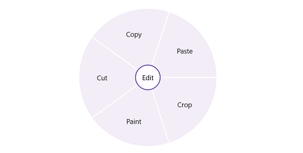

# Getting Started with .NET MAUI RadialMenu (SfRadialMenu)

This section provides a quick overview for working with the SfRadialMenu for .NET MAUI. Walk through the entire process of creating a real world of this control.

## Creating an application using the .NET MAUI RadialMenu
 1. Create a new .NET MAUI application in Visual Studio.
 2. Syncfusion .NET MAUI components are available on [nuget.org](https://www.nuget.org/). To add SfRadialMenu to your project, open the NuGet package manager in Visual Studio, search for Syncfusion.Maui.RadialMenu and then install it.

## Register the handler

To use this control inside an application, you must register the handler for Syncfusion® core.

**MauiProgram.cs**
```
using Microsoft.Extensions.Logging;
using Syncfusion.Maui.Core.Hosting;

namespace RadialMenuGettingStarted
{
    public static class MauiProgram
    {
        public static MauiApp CreateMauiApp()
        {
            var builder = MauiApp.CreateBuilder();
            builder
                .UseMauiApp<App>()
                .ConfigureSyncfusionCore()
                .ConfigureFonts(fonts =>
                {
                    fonts.AddFont("OpenSans-Regular.ttf", "OpenSansRegular");
                    fonts.AddFont("OpenSans-Semibold.ttf", "OpenSansSemibold");
                });

#if DEBUG
    		builder.Logging.AddDebug();
#endif

            return builder.Build();
        }
    }
}

```

## Add a basic SfRadialMenu
1. Import the control namespace `Syncfusion.Maui.RadialMenu` in XAML or C# code.
2. Initialize [SfRadialMenu](https://help.syncfusion.com/cr/maui/Syncfusion.Maui.Buttons.SfRadialMenu.html) control.

**XAML**
```
<ContentPage
    . . .    
    xmlns:radialMenu="clr-namespace:Syncfusion.Maui.RadialMenu;assembly=Syncfusion.Maui.RadialMenu">
        <radialMenu:SfRadialMenu />
</ContentPage>
```

**C#**
```
using Syncfusion.Maui.Core;
. . .

    using Syncfusion.Maui.RadialMenu;
    namespace RadialMenuGettingStarted
    {
        public partial class MainPage : ContentPage
        {
            public MainPage()
            {
                InitializeComponent();           
                 SfRadialMenu radialMenu = new SfRadialMenu();
                this.Content = radialMenu;
            }
        }   
    }

```

## Adding Radial Menu with items

**XAML**

```
<ContentPage 
            ...
             xmlns:radialMenu="clr-namespace:Syncfusion.Maui.RadialMenu;assembly=Syncfusion.Maui.RadialMenu">
        <radialMenu:SfRadialMenu x:Name="radialMenu" 
                                CenterButtonText="Edit"
                                CenterButtonFontSize="15">
            <radialMenu:SfRadialMenu.Items>
                <radialMenu:SfRadialMenuItem Text="Cut"
                                            FontSize="15"/>
                <radialMenu:SfRadialMenuItem Text="Copy"
                                            FontSize="15"/>
                <radialMenu:SfRadialMenuItem Text="Paste"
                                            FontSize="15"/>
                <radialMenu:SfRadialMenuItem Text="Crop"
                                            FontSize="15"/>
                <radialMenu:SfRadialMenuItem Text="Paint"
                                            FontSize="15"/>
            </radialMenu:SfRadialMenu.Items>
        </radialMenu:SfRadialMenu>
</ContentPage>
```

**C#**

```
using Syncfusion.Maui.RadialMenu;

namespace RadialMenuGettingStarted
{
    public partial class MainPage : ContentPage
    {
        public MainPage()
        {
            InitializeComponent();

            SfRadialMenu radialMenu = new SfRadialMenu()
            {
                CenterButtonText = "Edit",
                CenterButtonFontSize = 15
            };

            RadialMenuItemsCollection itemCollection = new RadialMenuItemsCollection();
            itemCollection.Add(new SfRadialMenuItem()
            {
                Text = "Cut",
                FontSize = 15
            });
            itemCollection.Add(new SfRadialMenuItem()
            {
                Text = "Copy",
                FontSize = 15
            });
            itemCollection.Add(new SfRadialMenuItem()
            {
                Text = "Paste",
                FontSize = 15
            });
            itemCollection.Add(new SfRadialMenuItem()
            {
                Text = "Crop",
                FontSize = 15
            });
            itemCollection.Add(new SfRadialMenuItem()
            {
                Text = "Paint",
                FontSize = 15
            });
            radialMenu.Items = itemCollection;
            this.Content = radialMenu;
        }
    }
}

```

Run the application to render the following output:



## License
This is a commercial product and requires a paid license for possession or use. Syncfusion’s licensed software, including this component, is subject to the terms and conditions of [Syncfusion's EULA](https://www.syncfusion.com/eula/es/?utm_source=nuget&utm_medium=listing&utm_campaign=maui-signaturepad-nuget). You can purchase a license [here]( https://www.syncfusion.com/sales/products?utm_source=nuget&utm_medium=listing&utm_campaign=maui-signaturepad-nuget) or start a free 30-day trial [here](https://www.syncfusion.com/account/manage-trials/start-trials?utm_source=nuget&utm_medium=listing&utm_campaign=maui-signaturepad-nuget).

## About Syncfusion
Founded in 2001 and headquartered in Research Triangle Park, N.C., Syncfusion has more than 26,000+ customers and more than 1 million users, including large financial institutions, Fortune 500 companies, and global IT consultancies.
 
Today, we provide 1600+ components and frameworks for web ([Blazor](https://www.syncfusion.com/blazor-components?utm_source=nuget&utm_medium=listing&utm_campaign=maui-signaturepad-nuget), [ASP.NET Core](https://www.syncfusion.com/aspnet-core-ui-controls?utm_source=nuget&utm_medium=listing&utm_campaign=maui-signaturepad-nuget), [ASP.NET MVC](https://www.syncfusion.com/aspnet-mvc-ui-controls?utm_source=nuget&utm_medium=listing&utm_campaign=maui-signaturepad-nuget), [ASP.NET WebForms](https://www.syncfusion.com/jquery/aspnet-webforms-ui-controls?utm_source=nuget&utm_medium=listing&utm_campaign=maui-signaturepad-nuget), [JavaScript](https://www.syncfusion.com/javascript-ui-controls?utm_source=nuget&utm_medium=listing&utm_campaign=maui-signaturepad-nuget), [Angular](https://www.syncfusion.com/angular-ui-components?utm_source=nuget&utm_medium=listing&utm_campaign=maui-signaturepad-nuget), [React](https://www.syncfusion.com/react-ui-components?utm_source=nuget&utm_medium=listing&utm_campaign=maui-signaturepad-nuget), [Vue](https://www.syncfusion.com/vue-ui-components?utm_source=nuget&utm_medium=listing&utm_campaign=maui-signaturepad-nuget), and [Flutter](https://www.syncfusion.com/flutter-widgets?utm_source=nuget&utm_medium=listing&utm_campaign=maui-signaturepad-nuget)), mobile ([.NET MAUI](https://www.syncfusion.com/maui-controls?utm_source=nuget&utm_medium=listing&utm_campaign=xamarin-core-nuget), [Xamarin](https://www.syncfusion.com/xamarin-ui-controls?utm_source=nuget&utm_medium=listing&utm_campaign=maui-signaturepad-nuget), [Flutter](https://www.syncfusion.com/flutter-widgets?utm_source=nuget&utm_medium=listing&utm_campaign=maui-signaturepad-nuget), [UWP](https://www.syncfusion.com/uwp-ui-controls?utm_source=nuget&utm_medium=listing&utm_campaign=maui-signaturepad-nuget), and [JavaScript](https://www.syncfusion.com/javascript-ui-controls?utm_source=nuget&utm_medium=listing&utm_campaign=maui-signaturepad-nuget)), and desktop development ([WinForms](https://www.syncfusion.com/winforms-ui-controls?utm_source=nuget&utm_medium=listing&utm_campaign=maui-signaturepad-nuget), [WPF](https://www.syncfusion.com/wpf-ui-controls?utm_source=nuget&utm_medium=listing&utm_campaign=maui-signaturepad-nuget), [WinUI](https://www.syncfusion.com/winui-controls?utm_source=nuget&utm_medium=listing&utm_campaign=maui-signaturepad-nuget), [Flutter](https://www.syncfusion.com/flutter-widgets?utm_source=nuget&utm_medium=listing&utm_campaign=maui-signaturepad-nuget) and [UWP](https://www.syncfusion.com/uwp-ui-controls?utm_source=nuget&utm_medium=listing&utm_campaign=maui-signaturepad-nuget)). We provide ready-to-deploy enterprise software for dashboards, reports, data integration, and big data processing. Many customers have saved millions in licensing fees by deploying our software.
___

[sales@syncfusion.com](mailto:sales@syncfusion.com?Subject=Syncfusion%20Maui%20SignaturePad%20-%20NuGet) | [www.syncfusion.com](https://www.syncfusion.com?utm_source=nuget&utm_medium=listing&utm_campaign=maui-signaturepad-nuget) | Toll Free: 1-888-9 DOTNET